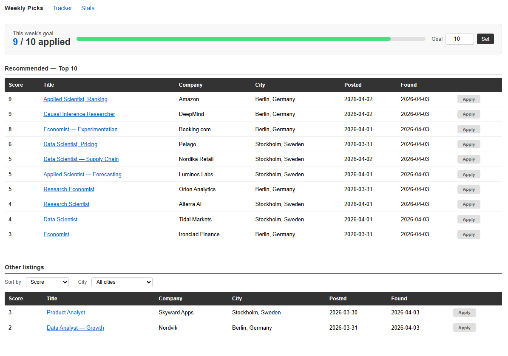
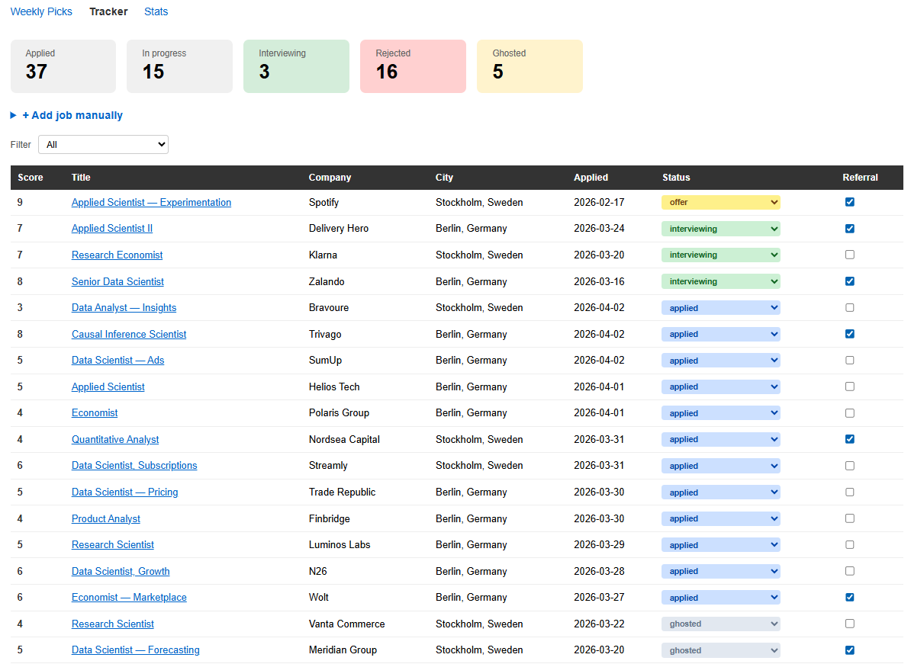
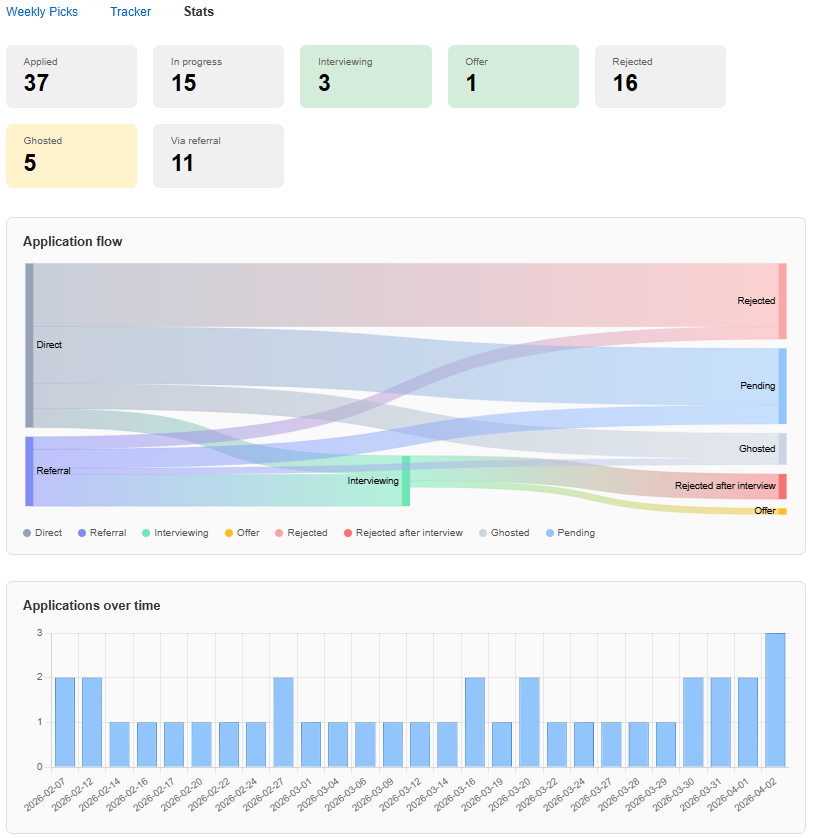

# Job Scraper & Tracker

A personal job search tool that scrapes listings from LinkedIn and Indeed, scores them by relevance, and lets you track your applications through a browser interface.
Built by an economist with zero programming experience. It's designed to be as simple and intuitive as possible, because life is already hard enough for us job seekers.

No Python, no dependencies, no complicated setup. If you can read, you can get this running in under 15 minutes (excluding scraping time).


---

## What it does

- Scrapes job listings across multiple cities and search terms
- Filters out irrelevant jobs (wrong language, wrong seniority, blocked companies)
- Scores remaining jobs by keyword relevance and company priority
- Surfaces the top-scored jobs each week with a weekly application goal
- Tracks application status through a browser UI at `localhost:5000`
- Ages and hides stale jobs automatically on each run

---

## Screenshots

*Weekly Picks — top scored jobs with application goal tracker*



*Tracker — full application pipeline*



*Stats — application flow, referral breakdown, timeline*



---

## Project structure
```
job_scraper/
├── templates/
│   ├── index.html           ← Weekly Picks page
│   ├── tracker.html         ← Tracker page
│   └── stats.html           ← Stats page
├── static/
│   └── chartjs-chart-sankey.min.js
├── config.example.yaml      ← copy this to config.yaml and edit it
├── config.py                ← loads config.yaml
├── filter.py                ← scoring and filtering logic
├── scraper.py               ← scrapes LinkedIn and Indeed
├── storage.py               ← all database reads and writes
├── main.py                  ← run this daily to scrape
├── app.py                   ← Flask web app
├── requirements.txt
├── Dockerfile
└── docker-compose.yml
```

## Setup

You only need one thing installed: **Docker Desktop**. No Python required.

**1. Install Docker Desktop**

Download from [docker.com](https://www.docker.com/products/docker-desktop/) and install it. Once installed, open it and wait until it shows **"Engine running"** in the bottom left. You can leave it running in the background — you won't need to click anything inside it.

**2. Download this project**

Go to the top of this GitHub page, click the green **Code** button, and select **Download ZIP**. Once downloaded, find the ZIP file (probably in your Downloads folder), right-click it, and select **Extract All**. Put the extracted folder somewhere easy to find, like your Desktop.

**3. Open a command window inside the folder**

Open the extracted folder. Click the address bar at the top of the window so it highlights, type `cmd`, and press Enter. A black window will appear — this is where you'll type all the commands below.

**4. Create your config file**

In the black window, run:

```
copy config.example.yaml config.yaml
```

Then open `config.yaml` in Notepad (right-click → Open with → Notepad) and fill in your own search terms and cities. This is the only file you'll ever need to edit. Save and close when done.

**5. Build the app**

```
docker compose build
```

This sets everything up inside Docker. It takes a few minutes the first time. Wait until it finishes and you see your prompt again.

**6. Run the scraper**

```
docker compose run --rm scraper
```

This fetches job listings and saves them to a local database. You'll see job counts printed for each city.

**7. Open the web app**

```
docker compose up app
```

Then open your browser and go to **http://localhost:5000**

You'll land on the Weekly Picks page with your scored jobs. To stop the app, press **Ctrl+C** in the black window.

---

## Daily workflow

1. Open Docker Desktop and make sure it's running
2. Open the black window in your project folder (same as Setup step 3)
3. Run the scraper: `docker compose run --rm scraper`
4. Start the web app: `docker compose up app`
5. Go to **http://localhost:5000** in your browser
6. On **Weekly Picks**: review the top-scored jobs and click **Apply** on the ones you applied to
7. Tick the referral checkbox on the **Tracker** page if you applied via a referral
8. Press **Ctrl+C** in the black window to stop the app when done

Jobs you've applied to, are interviewing at, or have offers from stay pinned at the top of the Tracker across sessions.

---

## The three pages

**Weekly Picks** (`/`) — shows the highest-scored new jobs from the past 7 days, split into your top-N recommendations and the rest. Includes a weekly application goal with a progress bar. Hit **Apply** to log an application directly from this page.

**Tracker** (`/tracker`) — your full application history. Shows every job you've applied to with its current status, applied date, and referral flag. Use the status dropdown to move jobs through the pipeline. Summary stat boxes at the top show your pipeline at a glance.

**Stats** (`/stats`) — visualises your job search funnel. The Sankey diagram splits applications by source (direct vs referral) and shows how each group progresses through interviewing, offers, and rejections. Includes an applications-over-time bar chart.

---

## Configuration

Everything is controlled from `config.yaml`. Open it in any text editor to make changes.

| Section | What it does |
|---|---|
| `search_terms` | Job titles to search for |
| `cities` | Locations to search, with language filter settings |
| `hours_old` | How recent the listings need to be (default: 72 hours) |
| `scoring.base_keywords` | Job must match at least one to appear at all |
| `scoring.priority_keywords` | Each match adds +1 to the score |
| `scoring.referral_companies` | Companies where you have a contact — +3 bonus points |
| `scoring.priority_companies` | Strong target companies — +1 bonus point |
| `scoring.negative_title_keywords` | Hard exclusion by title keyword |
| `scoring.blocked_companies` | Hard exclusion by company name |
| `scoring.senior_title_keywords` | Score penalty of -3, not a hard exclusion |
| `language_filters` | Words and phrases that identify postings in languages you don't want |

---

## Status lifecycle

| Status | Meaning |
|---|---|
| `new` | Scraped recently, not yet reviewed |
| `applied` | You applied — date recorded automatically |
| `interviewing` | Progressed to interview stage |
| `offer` | Received an offer |
| `rejected` | Rejected or withdrawn after applying |
| `rejected_after_interview` | Rejected after reaching interview stage |
| `ghosted` | Applied 7+ days ago with no response (auto-assigned) |
| `untrack` | Removed from tracker — recent jobs return to new, older ones are hidden |

Statuses are updated via the dropdown in the Tracker. The scraper automatically ghosts stale applications and hides old unreviewed jobs on each run.
---

## Tech stack

- **Python** — scraping, filtering, scoring, database writes
- **jobspy** — LinkedIn and Indeed scraping
- **SQLite** — local database, no server needed
- **Flask** — lightweight web framework for the UI
- **Docker** — runs everything without needing Python installed
- **Chart.js** — stats page visualisations

---

## License

MIT

## Contact

Chi Nguyen · chi.nguyen@economics.gu.se